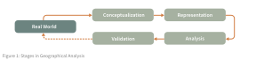

# __Course Information__  

GEOG 281A helps students design stronger, more rigorous geographic research by connecting the development and use of core spatial methods to their theoretical foundations in GIScience. Students explore fundamental topics including ontology and spatial representation, uncertainty and error propagation, spatial modeling and inference, and validation through open science practices (Figure 1). This course teaches students to think critically about the nature of spatial data and engage deeply with geographic scholarship rather than simply apply GIS tools in specific domains.

---

## __Contact and Availability__

- Instructor: Peter Kedron
- Email: [peterkedron@ucsb.edu](mailto:peterkedron@ucsb.edu)
- Office: Ellison Hall 5818
- Availability:
- Class Time and Location: Wednesdays 9:30-11:50 AM, Ellison Hall 4824

## __Learning Goals__

## __Student Work and Evaluation__

## __Course Schedule__

| Module | Week | Topic | Readings |
| --- | --- | --- | --- |
| __Framing GIScience as a Field__ | 1 | What is GIScience?   The Tool–Science Debate | [Mark (2000)](readings/wk1/mark2000.pdf)  [Wright et al.(1997)](readings/wk1/wright1997.pdf)  [Pickles (1997)](readings/wk1/pickles1997.pdf) [Fisher (1998)](readings/wk1/fisher1998.pdf) [Waters (2019)](readings/wk1/waters2019.pdf)  [Ricker et al.(2020)](readings/wk1/ricker2020.pdf) |
|  | 2 | GIScience and Geography Relationship | [O'Sullivan (2024) Chapter 9](readings/wk2/CGChapter9.pdf) [Goodchild (2004)](readings/wk2/goodchild2004.pdf) [Goodchild(2019)](readings/wk2/goodchild2019.pdf) [Guan et al.(2019)](readings/wk2/guan2019.pdf)   [Scheider et al.(2020)](readings/wk2/scheider2020.pdf)  |
| __Spatial Knowledge Construction and Representation__ | 3 | Spatial Ontology: Space, Place and Process | [Fisher et al.(1998)](readings/wk3/fisher1998.pdf)   [O'Sullivan (2024) Chapter 2](readings/wk3/CGChapter2.pdf)   [O'Sullivan (2024) Chapter 4](readings/wk3/CGChapter4.pdf)   [O'Sullivan (2024) Chapter 8 pg.211-226](readings/wk3/CGChapter8-1.pdf) |
|  | 4 | The Nature of Spatial Data: Vector and Raster Data Models, Knowledge Graph   Spatial Interpolation and Generalization   Spatial Database Management  Laws in Geography| GIS&T Body of Knowledge   [Vector Formats](https://gistbok-topics.ucgis.org/CV-02-003)   [Raster Formats](https://gistbok-topics.ucgis.org/CV-02-020)   [Data Model Conversions](https://gistbok-topics.ucgis.org/DM-06-086)   [Generalization](https://gistbok-topics.ucgis.org/DM-06-085)   [New Data Models](https://gistbok-topics.ucgis.org/FC-05-043)   [Spatial Database](https://gistbok-topics.ucgis.org/DM-01-001), [GeoDatabase](https://gistbok-topics.ucgis.org/DM-01-004), and their [limitations](https://gistbok-topics.ucgis.org/DM-01-070)   [Laws in Geography](https://gistbok-topics.ucgis.org/DM-01-070) | 
| __From Representation to Inference and Decision Support__ | 5 | Modern Cartographic Research: Representation, Mapmaking, Map Use, and Interaction   Fundamentals of Maps   Scientific Thinking and Communication in Cartography   Questioning Maps| [Monmonier(1991) Chapter 2-3](readings/wk5/Monmonier2-3.pdf)   [Roth(2004)](readings/wk5/Roth2004.pdf)   Optional:   [Imof(1975)](readings/wk5/imof-1975.pdf)   [Cleland (1921)](readings/wk5/cleland18-26.pdf) |
|  | 6 | Descriptive and Exploratory Spatial Models   Spatial Causal Inference | TBD |
| __Limits, Uncertainty, and Critique__ | 7 | Limits and Uncertainty   Data- and Method-Driven Uncertainty   Spatial Confounding Variables   Sensitivity Analysis   Robustness Check   Critiques of GIScience | TBD |
| __Evaluating and Validating Spatial Knowledge__ | 8 | Open GIScience Practices and Provenance    Reproducibility and Replicability   Internal and External Validity| TBD |
| __Ethics and Responsibility in GIScience__ | 9 | Ethical Considerations   Governance of Spatial Knowledge | TBD |
| __Future Directions and Synthesis__ | 10 | Research Frontiers   Course Conclusion | TBD |