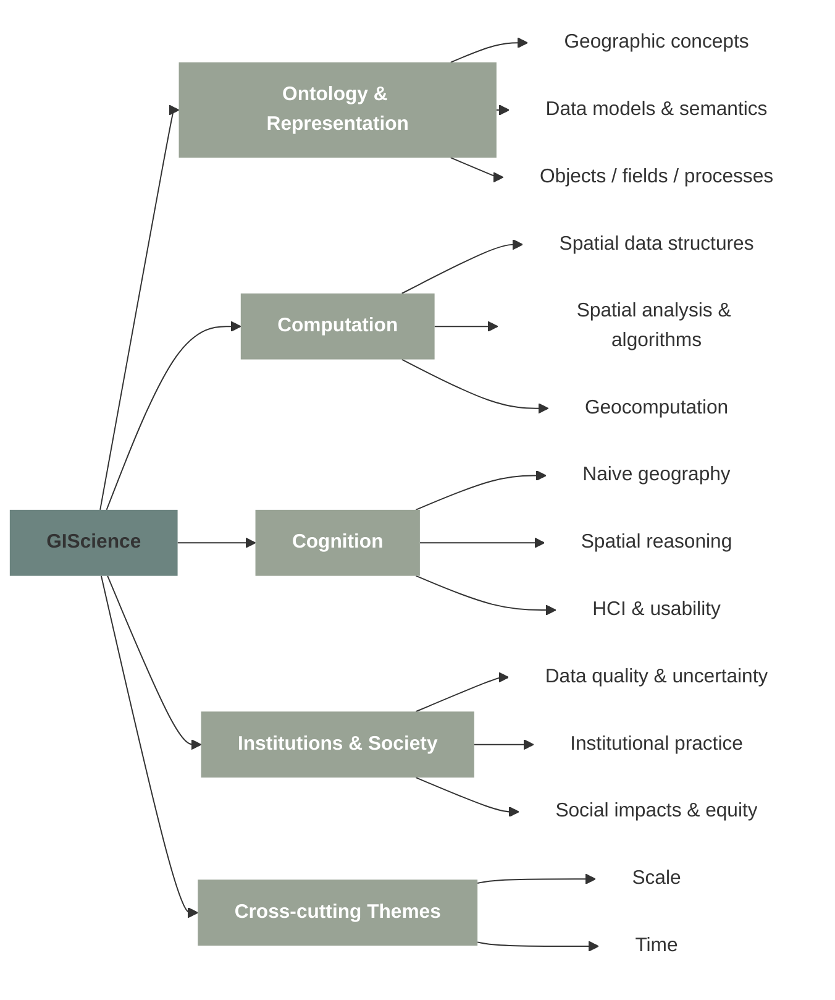

# __What is Geographic Information Science?__  

Geographic Information Science (GIScience) emerged in the 1990s alongside the rapid growth of Geographic Information Systems (GIS), but from the beginning its identity was uncertain. Is GIScience simply the use of GIS software? Is it the development of new tools? Or is it a scientific field with its own objects of study, theories, and research questions?

The definition provided by UCGIS at the onset of its foundation provided the following definition:
> The University Consortium for Geographic Information Science is dedicated to the development and use of theories, methods, technology, and data for understanding geographic processes, relationships, and patterns. The
transformation of geographic data into useful information is central to geographic information science.”

A full definition of GIScience was also provided in a report on a workshop held in January 1999 at the National Science Foundation: 
> Geographic Information Science (GIScience) is the basic research field that seeks to redefine geographic concepts and their use in the context of geographic information systems. GIScience also examines the impacts of GIS on individuals and society, and the influences of society on GIS. GIScience re-examines some of the most fundamental themes in traditional spatially oriented fields such as geography, cartography, and geodesy, while incorpo-
rating more recent developments in cognitive and information science.

David Mark (2000) addresses these questions directly by arguing that GIScience is a legitimate scientific field with a coherent intellectual core, distinct from both GIS as a tool and from geography as a disciplinary tradition. The central point is that:

- __Using GIS in research does not automatically constitute GIScience__
- GIScience focuses on the foundations of geographic information, not on applications alone

---

## __History of GIScience__

Mark distinguishes between the history of GIS systems and the history of GIScience as a research field, and identified the following key moments:

- NCGIA (1988), which articulated early research problems in spatial analysis, data structures, visualization, and social implications
- Goodchild (1990–1992), who named GIScience but emphasized research topics rather than definitions
- UCGIS (1990s), which formalized research priorities and institutionalized GIScience
- Project Varenius, which proposed a framework linking cognition, computation, and society

---

## __Components of GIScience__

The nature of the field of Geographic Information Science can be characterized by listing its components. These components describe what GIScientsts study, rather than how they apply GIS.

__Ontology__ is a branch of philosophy that deals with the most fundamental aspects of scientific inquiry at a very high level of abstraction. This part of GIScience examines the georgaphic information and geographic concepts that are used by environmental and social scientists in their research. It has also been used in information science and knowledge representation to refer to the specifications of the conceptualizations employed by different groups of users. 

__Computation__ concerns the algorithmic and formal foundations that make geographic information analyzable in digital systems. It covers how spatial relations, objects, and processes are represented, calculated, and searched within finite-precision computing environments. This includes qualitative spatial reasoning frameworks, computational geometry, spatial indexing and retrieval methods, spatial statistics, and other geocomputational approaches such as map algebra and cellular automata.

__Cognition__ focuses on how humans perceive, conceptualize, reason about, and interact with geographic space and geographic information. It draws on psychology, cognitive science, and linguistics to study human understanding of spatial concepts such as distance, direction, regions, and relationships, often emphasizing qualitative and context-dependent reasoning rather than precise metrics. This component aßlso includes research on human–computer interaction and GIS usability, 

__Applications & Institutions__ examines how geographic information is acquired, evaluated, and used within social, institutional, and political contexts. It includes research on data acquisition technologies, data quality, error, and uncertainty, as well as spatial analysis methods and their limitations. Beyond technical concerns, it addresses the societal impacts of GIS, including issues of governance, equity, power, commercialization, and public participation. 

__Cross-cutting Research Themes__ refer to fundamental issues that permeate all areas of GIScience rather than belonging to a single component. Time and scale are especially central, influencing how geographic phenomena are represented, analyzed, and interpreted. Temporal dynamics challenge traditional GIS representations that separate space and time, while scale affects geometry, data quality, spatial analysis, and cognitive interpretation.

---

Reference:

*Mark, D. M. (2000). Geographic information science: Defining the field. In J. P. Wilson & J. C. Fotheringham (Eds.),The handbook of geographic information science(pp. 3–18). Oxford: Blackwell Publishers.*
