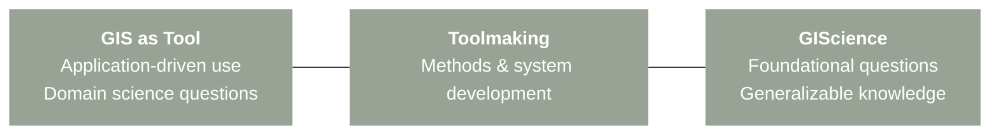
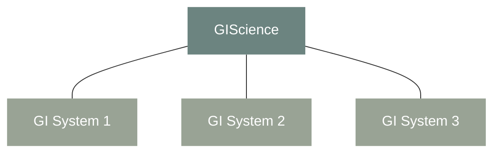
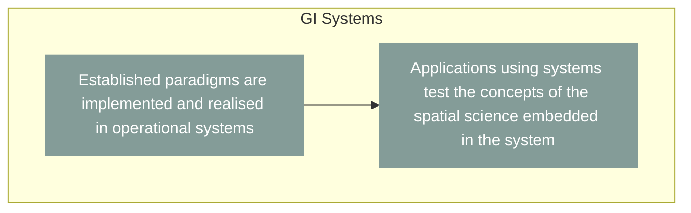
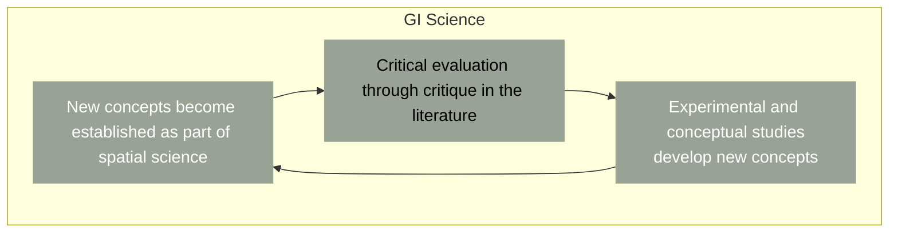

# __The Tool Science Debate in GIScience__

Continuing on this discussion raised before on *what essentially is GIScience*, there exist this debate on whether it should be recognized as a tool or science. Over time, scholars have taken on different perspectives and approaches towards answering this question as well as towards justifying the role of GIScience.

## __The Tool-Science Continuum__

Wright et al. (1997) argue that GIS should not be classified strictly as either a tool or a science, but instead understood along a continuum. The tool-science binary is limited in scope since GIS could not be understood by two distinct positions. We need the scientific knowledge to properly use the tool and the tool allows to better understand a scientific discipline. On one end of the continuum, GIS is a tool <a class="sidenote-ref" href="#sn-1">1</a>or technical instruments that support research, analysis, and decision-making in other disciplines. On the other end, it is a science <a class="sidenote-ref" href="#sn-2">2</a> that studies geographic information itself. In betwen the two ends of the continuum is the toolmaking <a class="sidenote-ref" href="#sn-3">3</a> that embeds scientific ideas into systems—these roles coexist rather than compete.

<strong>1.</strong> In this view, GIS does not itself generate new scientific knowledge; rather, it provides methods for storing, visualizing, manipulating, and analyzing spatial data in service of externally defined research questions.

<strong>2.</strong>This includes how geographic phenomena are conceptualized, represented, modeled, analyzed, and understood, independent of any specific application domain. fundamental research questions

<strong>3.</strong> This involves the design, development, and refinement of GIS software, algorithms, data structures, and analytical techniques.

## __Continuum is the Wrong Metaphor__

Fisher (1998), however, argues that the construction is theoretically problematic for resulting in polarization of the subject material. Specifically, it implies that the users of a GISystem cannot be indulding in a valid scientific endevour unless it is in the scientific domain of their subject. Many individuals both employ extant commerical GIS do develop new and interesting spatial theory, which may employ development of source code because no GIS can be used as a vehicle for implementation of the novel concepts developed.

Thus, the GISystem is a black box, being the implementation of the spatial concepts developed within the GIScience. No GISystem embodies all the concepts of GIScience, rather any particular GISystem implements only a subset which is identified as appropriate by the system developers in collaboration with some potential group of users. 

Fisher proposes that GIS and GIScience should be understood through a cyclical model, not a continuum. In this model, scientific concepts inform system development; systems are then used in applications; applications generate feedback that reshapes scientific understanding. GIScience and GIS systems co-evolve. Rather than asking whether GIS is a science, Fisher asks how scientific knowledge is produced through practice, implementation, critique, and revision. GIS systems are not secondary to science—they are part of how science happens.

  

  

Along those line, Pickles (1997)<a class="sidenote-ref" href="#sn-4">4</a> also challenges the framing of the tool–science debate itself, though from a different pespecitve. He argues that the binary tool-science debate abstracts GIS from its social, political, and institutional contexts. He is skeptical of attempts to legitimize GIS purely through claims of scientific neutrality or technical sophistication. In addition to asking __“What is GIS?”__, we need to think about __“What does GIS do, and for whom?”__ This is an early move toward what later becomes Critical GIS.

<strong>4.</strong> While Fisher emphasizes epistemic cycles between systems and science, Pickles tries to foreground the social embedding of those cycles:who controls them, who benefits from them, and whose knowledge is excluded.

## __Contemporary Reconcilation__

More recently, Ricker et al. (2020) argue that continuing to debate whether GIS is a tool or a science is often counterproductive, especially in interdisciplinary research contexts. They propose a role-based framework: GIS can function as a tool (basic use of existing software), toolmaking (custom development and system design), or science (advancing spatial theory, methods, and critical understanding). The key is not deciding which GIS “really is,” but explicitly identifying __which role GIS plays in a given project and what expertise is required__. If we translate philosophical debate into practical guidance, then GIScience no longer needs to prove it is a science; instead, it must clarify responsibilities, expertise, and ethical implications.

## __Towards Scientific Practice__

The broad practice-centered view of scientific knowledge articulated in the presidential address reframes the earlier tool–science debate by shifting attention from what counts as “theory” or “tool” to how knowledge is produced through practice.

  

According to Waters (2016), scientific inquiry operates within an investigative matrix that links data, material techniques, models, and explanations through iterative manipulation of phenomena in the world. Core theory informs these investigations, but it does not dictate them; instead, explanations emerge from the interaction between theoretical commitments and practical engagements with phenomena. This view resonates strongly with Fisher’s critique of the tool–science metaphor in GIScience. Just as GIS applications are not mere implementations of pre-existing theory, scientific knowledge more broadly is generated through cycles of experimentation, critique, and refinement rather than linear application of theory to the world.

---

Reference:

*Wright, D. J., Goodchild, M. F., & Proctor, J. D. (1997). GIS: tool or science? Demystifying the persistent ambiguity of GIS as "Tool" versus "Science". Annals of the Association of American Geographers, 346-362.*

*Pickles, J. (1997). Tool or science? GIS, technoscience, and the theoretical turn.*

*Ricker, B. A., Rickles, P. R., Fagg, G. A., & Haklay, M. E. (2020). Tool, toolmaker, and scientist: case study experiences using GIS in interdisciplinary research. Cartography and Geographic Information Science, 47(4), 350-366.*

*Waters CK. Presidential Address, PSA 2016: An Epistemology of Scientific Practice. Philosophy of Science. 2019;86(4):585-611.*
