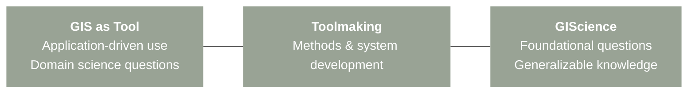
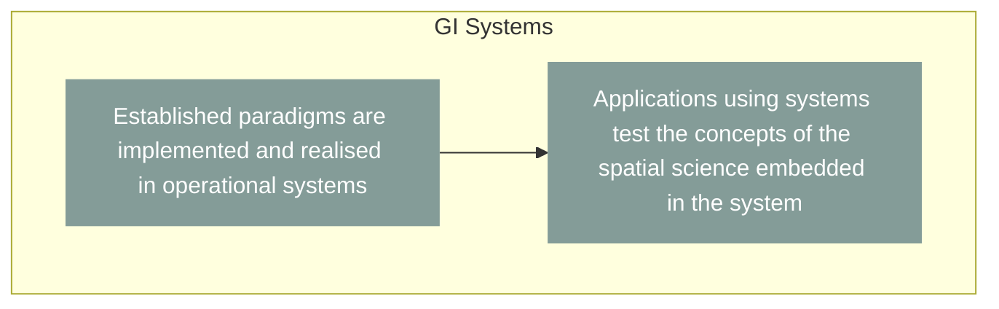
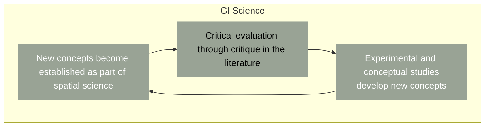

# __The Tool Science Debate in GIScience__

As GIS and GIScience emerged as technologies and a field of study near the end of the 20th century, and essential question was repeatedly asked - *What is GIScience?*. 
This queston led to a vigorous debate with the geographic community over whether GIS and GIScience should be recognized as a tools or science. 
Scholars have taken different perspectives and offered different answers to this question.
Consider three of these persepctives - a continuum, a bi-cyclic system, and an investigative matrix.

## __The Tool-Science Continuum__

Wright et al. (1997) argue that GIS should not be classified strictly as either a tool or a science, but instead understood along a continuum. The tool-science binary is limited in scope since GIS could not be understood by two distinct positions. Scientific knowledge is needed to properly use the GIS as a tool and that tool allows individuals to better understand a scientific question. On one end of the continuum, GIS is a tool <a class="sidenote-ref" href="#sn-1">1</a>or technical instruments that support research, analysis, and decision-making in other disciplines. On the other end, it is a science <a class="sidenote-ref" href="#sn-2">2</a> that studies geographic concepts and their use in creating geographic information. In betwen the two ends of the continuum is the toolmaking <a class="sidenote-ref" href="#sn-3">3</a> that embeds scientific ideas into systems—these roles coexist rather than compete.

<strong>1.</strong> GIS does not itself generate new scientific knowledge; rather, it provides methods for storing, visualizing, manipulating, and analyzing spatial data in service of externally defined research questions.

<strong>2.</strong> Including how geographic phenomena are conceptualized, represented, modeled, analyzed, and understood, independent of any specific application domain. fundamental research questions

<strong>3.</strong> the design, development, and refinement of GIS software, algorithms, data structures, and analytical techniques.

```mermaid
graph LR
  T["<b>GIS as Tool</b><br/>Application-driven use<br/>Domain science questions"]
  M["<b>Toolmaking</b><br/>Methods & system development"]
  S["<b>GIScience</b><br/>Foundational questions<br/>Generalizable knowledge"]

  T --- M --- S

%% Styling
  classDef component fill:#99a395ff,stroke-width:0px,color:#ffffff;
  class T,S,M component;

```

## __A Continuum is the Wrong Metaphor__

Fisher (1998) argues that conceptualizing GIS-GIScience as a continuum is problematic because it leads to a false polarization and misses important interactions between concept innovation and tool development. Specifically, the continuum metaphor could be read to imply that the users of a GISystem are not be indulding in a valid scientific endevour unless it is in the scientific domain of their subject. However, many individuals both use existing GISystems do develop new and interesting spatial theory. Conversly, individuals developing new spatial concepts may also test and develop those concepts by moving them into GISystems through practices such as coding.

Fisher presents an alternative view. Rather than a continuum, Fisher argues that there are two related cycles of development that are continually interacting. At a conceptual level, geographers and GIScientists are continually developing spatial concepts that could potentially be used to represent and analyze processes occuring in the real world. Through time some of those concepts become part of an established set of concepts that are critiqued and revised. At the same time, an particular GISystem implements a subset of the available concepts in specific way. At a systems level, those selected concepts are operationalized within a computational framework and used to study processes in the real world. As tools succeed or fail in capturing and analyzing those processes they are revised, as are the concepts that underlie them. 

```mermaid
flowchart LR
  subgraph GSys["GI Systems"]
    direction LR
    S1["Established paradigms are implemented and realised in operational systems"]:::system
    S2["Applications using systems test the concepts of the spatial science embedded in the system"]:::system
    S1 --> S2
  end

  classDef system fill: #849c98ff,stroke-width:0px,color:#ffffff;

```

  

  

```mermaid
%%{init: {'flowchart': {'nodeSpacing': 50, 'rankSpacing': 30}}}%%
%%{init: {'themeVariables': { 'fontSize': '18px' }}}%%


flowchart LR
  subgraph GSys["GI Science"]
  direction LR
    C1["New concepts become established as part of spatial science"]
    CR["Critical evaluation through critique in the literature"]
    C2["Experimental and conceptual studies<br/>develop new concepts"]

    C2 --> C1
    C1 --> CR
    CR --> C2
  end 

  classDef science fill:#99a395ff,stroke-width:0px,color:#ffffff;
  classDef critique fill:#99a395ff,stroke-width:0px,color:#000000;

  class C1,C2 science;
  class CR critique;
```

In this model, GIScience and GIS systems co-evolve. Scientific concepts inform system development; systems are then used in applications; applications generate feedback that reshapes scientific understanding. 
Rather than asking whether GIS is a science, Fisher asks how scientific knowledge is produced through practice, implementation, critique, and revision. 
GISystems are not secondary to science—they are part of how science happens.

Pickles (1997)<a class="sidenote-ref" href="#sn-4">4</a> similarly challenges the framing of the tool–science debate, but from a different pespecitve. 
He argues that the binary tool-science debate abstracts GIS from its social, political, and institutional contexts. 
Specifically, Pickles is skeptical of attempts to legitimize GIS purely through claims of scientific neutrality or technical sophistication. 
In addition to asking __“What is GIS?”__, we need to think about __“What does GIS do, and for whom?”__<a class="sidenote-ref" href="#sn-5">4</a> 

<strong>4.</strong> While Fisher emphasizes epistemic cycles between systems and science, Pickles tries to foreground the social embedding of those cycles:who controls them, who benefits from them, and whose knowledge is excluded.

<strong>5.</strong> Pickles argument is an early development what later becomes Critical GIS. His edited book *Ground Truth* is a seminal work in this sub-field of GIScience and one of the first synthetic surveys of these arguments.

## __A Contemporary Focus on Roles and Practice__ 

Returning to this GIScience-GISystems debate almost 30 years later, Ricker et al. (2020) argue that continuing this debate is often counterproductive, especially in interdisciplinary research contexts. 
They propose a alternative role-based framework. 
Ricker et al. point out that GISystems can function as a tool (basic use of existing software), toolmaking (custom development and system design), or science (advancing spatial theory, methods, and critical understanding). 
Rather than resolving the debate in on function, the authors shift the debate to focus on the not deciding which GIS “really is,” but explicitly identifying __which role GIS plays in a given project and what expertise is required__. 
If focus shifts from a philosophical debate into practical guidance, then GIScience no longer needs to prove it is a science. 
Instead the task for GIScientists becomes clarifying the responsibilities, expertise, and ethical implications of practices that use spatial concepts and/or GISystems.

This conception of GISsystems and GIScience as a practuce aligns with broader practice-centered views of scientific knowledge articulated within the philosophy of science. 
For example, Waters (2016) presidential address can be used reframes the earlier tool–science debate by shifting attention to practice.

  

According to Waters (2016), scientific inquiry operates within an investigative matrix that links data, material techniques, models, and explanations through iterative manipulation of phenomena in the world. 
Core theory informs these investigations, but it does not dictate them; instead, explanations emerge from the interaction between theoretical commitments and practical engagements with phenomena. 
This view resonates strongly with Fisher’s critique of the tool–science metaphor in GIScience. 
Just as GIS applications are not mere implementations of pre-existing theory, scientific knowledge more broadly is generated through cycles of experimentation, critique, and refinement rather than linear application of theory to the world.
Practices lead to revisions of GISystems and spatial concepts as researchers work to make sense of complicated geographic phenomena. 

---

Reference:

*Wright, D. J., Goodchild, M. F., & Proctor, J. D. (1997). GIS: tool or science? Demystifying the persistent ambiguity of GIS as "Tool" versus "Science". Annals of the Association of American Geographers, 346-362.*

*Pickles, J. (1997). Tool or science? GIS, technoscience, and the theoretical turn.*

*Ricker, B. A., Rickles, P. R., Fagg, G. A., & Haklay, M. E. (2020). Tool, toolmaker, and scientist: case study experiences using GIS in interdisciplinary research. Cartography and Geographic Information Science, 47(4), 350-366.*

*Waters CK. Presidential Address, PSA 2016: An Epistemology of Scientific Practice. Philosophy of Science. 2019;86(4):585-611.*
