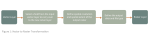
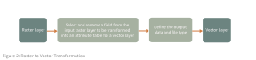

# __The Nature of Spatial Data__

Before beginning this lesson, let’s return to a foundational idea from last week’s discussion of spatial ontologies: the __GeoAtom__. The GeoAtom treats every geographic fact as the combination of where something is and what it is, which reminds us that geography is always both locational and thematic. But throughout the entire week, we mainly focused on conceptual side of representation. But conceptual representation alone is not enough. If spatial ontologies define how we understand the world, we now need to ask: __how are these abstract concepts translated into computational form?__ In other words, __how does a GeoAtom become data?__

This week, we will examine how geographic entities are encoded in computers through spatial data models. These models are not neutral containers but operationalize particular assumptions about space, objects, and fields. Grounding technical implementation in fundamental spatial concepts strengthens research design and methodological clarity in a variety of ways because when choosing a data model, we are not simply choosing a file format, but how space is conceptualized, how relationship is preserved, and determining what kind of analyses become possible as well as what kinds of distortions or simplifications are introduced.

We will begin with conventional vector and raster models, and then examine transformations between them. We will also explore spatial interpolation and spatial generalization as examples of transformations both within and across models. Finally, we will briefly consider emerging paradigms such as knowledge graphs that expand how spatial relationships can be encoded.

_A small but important note: when we refer to “models” here, we are speaking about data models (formal structures for representing spatial information) which differ from statistical or predictive models you may encounter elsewhere._

## __Vector Model Basics__

Spatial data can be represented in vector or raster form, each with distinct advantages, limitations, and tradeoffs in how data can be stored, analyzed, manipulated, and visualized. Much of this distinction parallels last week’s discussion of spatial ontologies. If space can be conceptualized as composed of discrete objects (place-based entities with boundaries) or as continuous processes unfolding across surfaces, then vector and raster data models operationalize these different worldviews.

Vector data aligns most naturally with an object-based ontology of space that treats geographic phenomena as discrete entities. It is composed of spatial features that are assigned a geographic location, encoded as either:  

- __Points__: a single coordinate pair representing a specific location (e.g., a monitoring station, a crime event).
- __Lines__: an ordered list of coordinate pairs representing linear features (e.g., roads, rivers, migration paths).
- __Polygons__: an ordered list of coordinate pairs where the first and last points coincide, forming a closed boundary (e.g., parcels, census tracts, ecological zones).

Each feature carries associated attribute data describing what it is. Attributes may be quantitative (population, traffic volume) or qualitative (zoning type, land cover category). In GeoAtom terms, vector data explicitly encodes the “where” through geometry and the “what” through attributes. This makes vector particularly suitable for representing places, which are bounded entities that we conceptualize as objects. It also supports representations of processes well when those processes are event-based (e.g., disease cases as points, movement trajectories as lines). 

Common format of vector data include shapefile, KML/KMZ, CSV, GPX, GeoJSON/TopoJSON, Geodatabase, PostGIS, though each of which has their best use. 

A few more technical characteristics that influence how vector data performs include:

__Indexing__, which enables efficient retrieval of spatial features, which becomes essential when querying large datasets or performing computationally intensive spatial analysis.

__Topology__, which encodes spatial relationships such as adjacency or shared boundaries. This is crucial when spatial relationships themselves are meaningful

__Projections__, which determine how locations in abstract geographic space are translated into planar coordinate systems.

__Geometric accuracy__, which reflects how faithfully boundaries and vertices are preserved. Some representations (e.g., vector tiles) deliberately simplify geometry for performance.

In short, vector representations are especially powerful when modeling discrete, well-defined phenomena. They preserve boundaries, support multiple attributes per feature, and enable complex spatial operations such as buffering, overlay, and network analysis. Because they maintain explicit geometric detail, they often produce visually refined cartographic outputs. At the same time, vector data implicitly assumes that space can be partitioned into discrete objects, which is conceptually aligned with certain ontologies of place, but not all geographic phenomena conform neatly to that framing.

## __Raster Model Basics__

In contrast to vector formats, which represent space using geometric primitives that are generally resolution-independent, raster formats represent space as a grid of cells at a defined resolution. At its core, a raster is a matrix composed of regularly spaced rows and columns, where each cell (or pixel) stores a single value. Spatial location is defined implicitly by a cell’s position within the grid rather than through explicit coordinate pairs.

Each pixel in a raster has an associated bit depth, which determines how much information it can store. Standard digital imagery commonly uses 8 bits per color channel (Red, Green, Blue), while scientific datasets such as Digital Elevation Models (DEMs) often rely on 16-bit or 32-bit formats to preserve numerical precision. The choice of bit depth affects the range and accuracy of values that can be represented. Raster data are stored in formats such as PNG, JPG, TIFF, and GIF, though spatial analysis workflows frequently rely on georeferenced formats such as GeoTIFF, which embed coordinate system and projection information. Decisions about resolution, bit depth, and file format are therefore not merely technical but central to analytical design and cartographic workflow.

Rasters are most naturally suited to representing continuous phenomena such as elevation, temperature, precipitation, or reflected electromagnetic radiation. These phenomena align with a field-based ontology of space, in which every location has a value and spatial variation is gradual rather than bounded. Because rasters treat space as a continuous surface sampled at regular intervals, they provide an intuitive structure for modeling surfaces and gradients.

One major advantage of raster storage is computational efficiency. Because spatial coordinates are stored implicitly through grid position rather than explicitly as vertex lists, rasters can require less storage than high-density vector representations of continuous surfaces. As a result, terrain analysis (such as slope, aspect, and hillshade), surface modeling, spatial interpolation, suitability analysis, and many classification workflows are computationally efficient within a raster framework.

Despite these strengths, raster models have important limitations. Unlike vector models, rasters do not explicitly preserve topological relationships, and they do not naturally support multiple attributes per spatial unit without additional data structures. Most raster datasets operate at a single spatial resolution, though multi-resolution pyramids may be constructed to improve visualization performance. Reprojection or resampling typically introduces some degree of data degradation, particularly if transformations are performed repeatedly. For this reason, analytical transformations should ideally be conducted from the original source data rather than through serial processing of intermediate outputs. When raster resolution is coarse relative to the spatial phenomena being represented, a blocky or pixelated appearance can happen. 

## __Vector to Raster Transformation__ 

Because vector and raster data models support different representations of spatial phenomena, and therefore different analytical workflows, GIS professionals frequently need to move between them. Analytical goals often dictate model choice, and conversion becomes a necessary step in computational pipelines.

Returning to last week’s framing: when we move between vector and raster, we are not simply changing file types. We are also transforming how space is conceptualized. When an object-based representation of place is being translated into a field-based surface, that translation requires rules, and we will illustrate some of those below.

Vector-to-raster conversion, commonly called rasterization, is the process of converting vector points, lines, or polygons into a gridded surface composed of raster cells. The process includes the following key steps:

__Point to Raster__:  At its most fundamental level, a single vector point representing one geographic feature can be converted into a raster cell. The raster cell that contains the point is assigned a value based on the chosen attribute (e.g., tree height, age, event count). This process assumes that the cell inherits the value of any point located within it. Complications arise when multiple points fall within the same raster cell. In such cases, the cell value may be assigned using a rule such as most frequent attribute value, mean or sum of values, binary presence (0/1), or count of points

Notice what is happening conceptually here is that a discrete event located at an exact coordinate is being aggregated into an area of finite extent. When a point-based representation of place is becoming an area-based summary, the choice of resolution would directly affect this transformation. This makes it not merely a technical step; it is a redefinition of spatial meaning.

__Lines to Raster__:  A vector line representing a linear feature can be converted into a series of adjacent raster cells that approximate its path across the grid. Raster cells are typically assigned the attribute value of the line intersecting each cell. Alternatively, a binary representation (0/1) may be used to indicate the presence or absence of a linear feature. Here, the transformation introduces discretization effects. A continuous geometric line must be approximated by square cells. Thus, thin features may become thicker, disconnected, or fragmented depending on resolution. From an ontological perspective, a bounded object defined by precise coordinates is now being translated into a grid-constrained representation. 

__Polygons to Raster__: A vector polygon representing areal features can be converted into clusters of raster cells. Raster cells typically inherit the attribute value of the polygon containing the cell center. However, alternative assignment rules may be used, including majority area containment, partial area weighting, binary presence etc. The choice of assignment rule matters, especially along boundaries. Cells that intersect multiple polygons may be forced to adopt a single dominant value, introducing boundary simplification and mixed-pixel effects. Conceptually, this conversion transforms a clearly bounded place into a tessellated surface approximation. The polygon’s exact boundary becomes a stair-stepped edge constrained by grid resolution. Again, resolution governs quality: finer grids better approximate shape, but never perfectly reproduce it.

## __Raster to Vector Transformation__

Raster-to-vector conversion, also known as vectorization, is the process of converting gridded cell- or pixel-based data into vector points, lines, or polygons. Where rasterization imposed a grid structure onto discrete objects, vectorization extracts discrete features from a continuous surface. In doing so, it requires rules for boundary detection, cell grouping, and geometry construction. Generally, the process includes the following key steps:

__Raster to Points__: A raster surface such as a Digital Elevation Model (DEM) can be converted into a set of vector points. Each point represents the centroid of a raster cell containing a valid data value, and the associated attribute table stores both the geographic location and the raster value (e.g., elevation).

Conceptually, this transformation converts an implicitly located grid value into an explicitly located object. What was previously part of a continuous field becomes a collection of discrete spatial observations. The underlying resolution of the raster determines the density of the resulting point dataset. In this sense, the “precision” of the vector points is constrained by the raster sampling interval from which they were derived.

__Raster to Lines__: Raster surfaces can also be converted into vector lines. Here, a process represented as a surface (flow intensity across cells) becomes a linear object (a stream channel). The geographic accuracy and smoothness of the resulting vector lines depend directly on the spatial resolution of the input raster. Coarse raster resolution may produce angular or stair-stepped line geometries, while finer resolution allows closer approximation of continuous features. Again, the ontology shifts here is that a field describing process intensity is being converted into a bounded object suitable for object-based analysis.

__Raster to Polygons__:Raster surfaces can certainly be converted into polygons, particularly when representing categorical data. For example, a land cover classification raster can be vectorized into polygons representing different land type categories. This allows GIS professionals to calculate areal coverage, perform spatial joins, and integrate the results into workflows that rely on object-based analysis. During conversion, adjacent cells with identical values are grouped into contiguous regions and represented as polygons. However, because raster boundaries are constrained by the underlying grid, the resulting polygon edges may appear stair-stepped, especially if the raster resolution is low.

This highlights an important point: vectorization does not restore the “true” boundary of a feature. It reconstructs an object from a discretized field. The geometry of the output polygons reflects the sampling structure of the raster. Resolution, therefore, shapes not only visual appearance but also the conceptual boundaries of place.

## __Spatial Interpolations__

When discussing transformation, it is also useful to move beyond format conversion and consider transformations at a higher representational level. Vectorization and rasterization change data structure, but spatial interpolation and spatial generalization change the meaning and structure of representation itself.

Spatial interpolation is a mathematical process used to estimate values at locations where no data have been collected. In doing so, it makes an ontological move by assuming that the phenomenon being measured varies across space in a structured way. As an example, advanced vector-to-raster conversions frequently rely on interpolation techniques to estimate raster cell values from vector point measurements.
Interpolation methods can be classified as deterministic or geostatistical, and as global or local in scope.

__Deterministic methods__ derive raster surfaces based on predefined assumptions about spatial context, such as distance decay or surface smoothness. These methods do not explicitly model uncertainty.

__Geostatistical (or stochastic) methods__, in contrast, explicitly incorporate spatial dependence. They model spatial autocorrelation among measured values and provide estimates of prediction uncertainty. In other words, they treat spatial structure as something to be quantified rather than assumed.

__Global interpolation methods__ use all available data points to estimate values across the entire study area. This typically results in smoother surfaces and emphasizes broad spatial trends.

__Local interpolation methods__ estimate values using subsets of nearby points. This neighborhood-based approach often better captures localized variation and spatial heterogeneity but may introduce discontinuities or boundary effects.

A few more examples that illustrate these above approaches include: 

__Inverse distance weighting__, which estimates a raster cell value using a weighted average of nearby input data points. Points closer to the prediction location exert greater influence than those farther away. It is intuitive and easy to implement and works well when data are relatively homogeneously distributed. However, it can over-smooth surfaces and generate artifacts in areas with high spatial variability.

__Natural neighbor__, which identifies nearby input points using a Voronoi tessellation and assigns weights based on proportional areas. It is computationally efficient and capable of modeling complex spatial relationships, but may struggle when input data are sparse or poorly distributed.

__Spline interpolation__, which fits a mathematical function to the input data points that both minimizes overall surface curvature and passes directly through the measured values. It works well for highly variable or complex spatial patterns, but can introduce over- or under-fitting when data are sparse.

__Polynomial interpolation__, which fits a single mathematical function across the entire dataset (global) or multiple functions across defined neighborhoods (local). It is effective for identifying long-range spatial trends and processes but is sensitive to outliers and neighborhood specifications.

Note that there is no single “best” interpolation method. Each embodies different assumptions about spatial continuity, smoothness, and scale. Choosing a method therefore means choosing a representation of process (how change should unfold across space).

## __Spatial Generalization__

Spatial generalization, on the other hand, is the process of simplifying geographic data to make it suitable for a specific map scale or purpose. It involves abstracting reality so that spatial patterns remain legible rather than visually overwhelming. While closely associated with cartography, which we will explore further in future lessons, generalization is also fundamentally about representation and scale.

Generalization modifies map content in a purposeful, measured, and coordinated manner. It is a contradictory process shaped by multiple constraints and tradeoffs. On one hand, generalization enhances usability. Reducing detail and complexity improves readability and interpretive clarity. It lowers cognitive load, which is crucial given the limitations of human visual perception. On the other hand, generalization inevitably removes information. Feature detail is lost, albeit intentionally and systematically. This can influence the kinds of knowledge that maps support. In ontological terms, generalization reshapes what counts as a meaningful object or boundary at a given scale. A river may shift from a polygon to a line. A dense neighborhood may shift from many houses to a single representative symbol. Scale changes the ontology of place.

Below are several typical transformations under generalization:

__Simplification__ removes non-essential vertices from lines or polygons while preserving overall shape. Algorithms such as Douglas–Peucker are commonly used for cultural features like roads, while Wang–Müller is often better suited to natural features such as rivers.

__Smoothing__ adjusts vertex positions to create a more visually flowing shape, reducing angularity introduced by simplification.

__Collapsing__ changes dimensionality as scale decreases, for example, converting a river polygon into a centerline, or representing a city area as a point.

__Selection__ determines which features are retained based on map purpose. It functions as the entry point for all other generalization processes.

__Elimination__ removes features according to defined thresholds (e.g., ponds smaller than one acre, roads shorter than 500 meters).

__Typification__ reduces feature count while preserving pattern. For instance, representing 100 houses with 10 representative symbols to convey density.

__Aggregation__ merges nearby discrete features into a larger unit, such as combining buildings into a single urban area polygon.

__Displacement__ slightly shifts overlapping features to maintain visibility at smaller scales.

__Exaggeration and Enhancement__ enlarges or emphasizes important features so they remain visible and interpretable.

__Classification__ groups detailed categories into broader ones (e.g., reclassifying species-level vegetation into “Forest”).

In this sense, interpolation and generalization together demonstrate that spatial data are not static containers of truth. They are structured representations shaped by assumptions about continuity, boundary, scale, and process.

## __Moving Towards New Data Models__

To conclude this week, it is worth asking a broader question: Are vector and raster the only ways to represent geographic information?
For decades, these two models have dominated GIS because they efficiently encode geometry whether being points, lines, polygons, and grids. But as spatial data become increasingly interconnected, distributed, and multi-source, new representational needs have emerged. In particular, the challenge is no longer just how to store geometry, but how to encode relationships, meaning, and knowledge. This is where Geospatial Knowledge Graphs (GeoKGs) enter the conversation.

A knowledge graph organizes information as a network of entities and relationships. Instead of structuring data primarily around geometric primitives (as vector and raster do), knowledge graphs structure data around concepts and connections.

In a graph structure, nodes represent entities (places, events, organizations, people, features), edges represent relationships between entities, then ontologies define the types of entities (classes) and relationships (properties), allowing machines to interpret meaning rather than just store values.

A Geospatial Knowledge Graph becomes geospatial when spatial references and spatial relationships are explicitly encoded within this graph structure. For example, a standard knowledge graph might store the fact that the Eiffel Tower is an iconic landmark. A GeoKG extends this by encoding:

- That the Eiffel Tower has a geometry.
- That it is located within Paris.
- That Paris is located within France.

Because these relationships are formally defined using ontologies such as GeoSPARQL, the system can perform logical reasoning. If it knows that “Paris is the capital of France” and “The Eiffel Tower is in Paris,” it can automatically infer that “The Eiffel Tower is in France” without explicit manual linkage.

As we connect this to spatial ontologies, we may see that vector and raster models operationalize space geometrically through objects and fields. GeoKGs, in contrast, operationalize place and process through semantic relationships. Place becomes a node with attributes and hierarchical relationships. Process can be encoded as temporal or causal relationships between nodes. Space becomes one type of relationship among many. Therefore, rather than simply asking “Where is it?” and “What geometry does it have?”, GeoKGs also ask “How is it connected?” and “What does it belong to?”. In this sense, GeoKGs extend the GeoAtom idea. 
