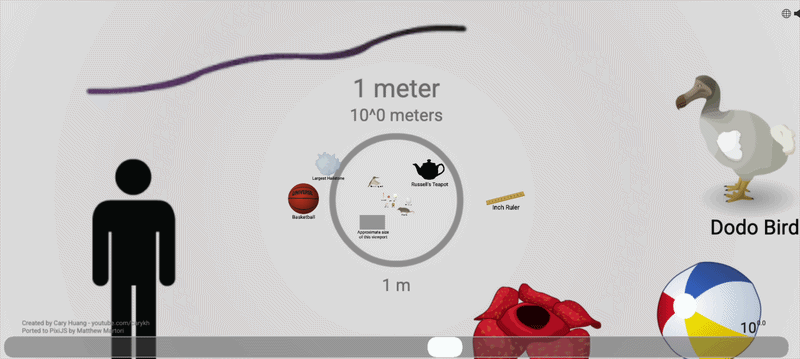
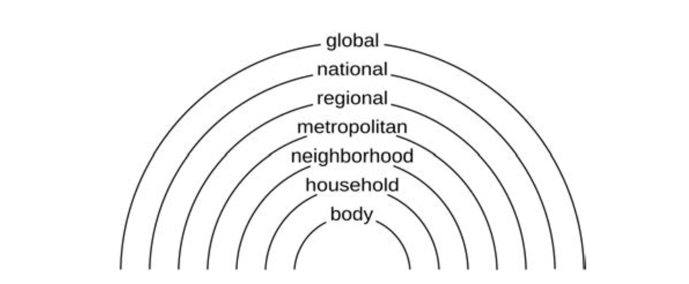

# __Scale in GIScience and Geography__

In the previous lesson, we focused on how geographic knowledge is represented and how maps support inference. This week, we move one step further in the process of geographical analysis: from representation to analysis. Once data are represented, researchers begin to analyze them—and this is where a new set of decisions emerges. Analysis is not simply a technical step, but a series of choices that structure how spatial patterns are detected, compared, and interpreted. Among the earliest and most fundamental of these decisions is scale.

Scale enters the picture at every stage of working with geospatial data, yet its importance is often overlooked. In many cases, its effects are subtle and easily hidden. The selections, simplifications, and omissions embedded in a dataset, arising from the scale at which data are collected and compiled, may pass unnoticed. However, this does not mean they are inconsequential. On the contrary, these choices quietly shape the structure of the data and, in turn, the outcomes of analysis. At other times, the effects of scale are highly visible. Patterns may appear or disappear, relationships may strengthen or weaken, and different features may come into or fall out of focus as data are aggregated, manipulated, or visualized at different scales. These shifts reflect fundamentally different ways of seeing and interpreting geographic phenomena. Because of this, the role of scale in geospatial research cannot be reduced to a matter of methodological convenience. Instead, scale, as a core concept in GIScience, is deeply intertwined with foundational ideas such as space, location, and spatial relationships. Developing an awareness of scale, therefore, is essential to building a more reflective and rigorous approach to geospatial analysis.

In this lesson, we explore the complexities of scale from two complementary perspectives. First, we examine scale as a theoretical concept in geography, considering how it has been defined, classified, and debated. Second, we turn to scale as a practical concern in GIScience and cartography, focusing on how decisions about scale influence data, analysis, and visualization in research practice.

## __Scale in Geographical Theory__

### __Scale as Size__

To begin, it is helpful to think about scale in its most intuitive sense: scale as size. In this view, scale refers to the magnitude or extent of phenomena, ranging from the very small to the very large. The universe itself is organized across an immense range of scales from microscopic particles to planetary and cosmic systems (__Figure 1__).

Recognizing this vast range helps put into perspective geographers’ frequent tendency to speak authoritatively about “scale.” In practice, no single study can engage with this full spectrum. Instead, researchers typically restrict their focus to a more manageable range, often examining phenomena that span three or four orders of magnitude: a thousand to ten-thousand-fold difference in size. This bounded perspective is not a limitation, but a necessary condition for meaningful analysis.



__Figure 1__: The universe is organized across an immense range of scales, from the very small to the very large. Click for [original source](https://htwins.net/scale2/)


### __Scale as Hierarchy__

Beyond size, scale is also commonly understood as hierarchy (__Figure 2__), which is an ordered arrangement of levels such as local, regional, national, and global. However, it is important to recognize that these hierarchical scales are not naturally given. Rather, they are constructed through particular observational practices and analytical methods, applied within specific contexts.
To the extent possible, data collection and analytical approaches should align with the spatial (and temporal) scales relevant to the phenomena under study. Yet even when such alignment is achieved, scale remains relational. It reflects not only the inherent properties of the phenomenon, but also the tools, methods, and perspectives through which it is investigated.

 

__Figure 2__: An example of how a series of qualitative scales might be considered nested one within another.

Importantly, hierarchical scales are often more conceptual than strictly size-based. The categories we use, such as city, region, or nation, do not always correspond neatly to differences in physical extent. For example, according to O’ Sullivan, a region like California or the U.S. Midwest may be larger than entire countries such as Ireland or New Zealand. Similarly, major metropolitan areas like Tokyo, New York, or London can exceed some nations in terms of population, economic activity, or spatial footprint. These examples illustrate that scale hierarchies are not fixed or universally ordered but depend on how we define and measure them.

Despite this mismatch between conceptual hierarchies and the complexity of reality, thinking in terms of scale hierarchies remains analytically useful. It allows researchers to focus on a particular level of interest while temporarily setting aside processes operating at much smaller or larger scales. Another example provided by O’Sullivan here is that in a study of statewide changes in the California public school system, it may be reasonable to bracket out both fine-scale variations among individual schools and broader influences from national or global policy contexts. In this way, scale serves as a practical tool for bounding analysis and structuring inquiry, even if the boundaries themselves are imperfect.

<div class="image-row">
  <a href="../../assets/scale-eg1.png" class="zoomable">
    
  </a>

  <a href="../../assets/scale-eg2.png" class="zoomable">
    
  </a>
</div>

__Figure 3__: Another example of how thinking in terms of hierarchy is helpful is in public health research. In this case, disease patterns are often analyzed at multiple scales, such as neighborhoods, cities, or regions. For instance, a study of COVID-19 transmission might focus on county-level variation to understand regional disparities, while temporarily setting aside individual-level behavior or global mobility patterns. Although these processes interact, organizing the analysis hierarchically allows researchers to isolate patterns that are most relevant at a particular level of intervention. The two examples here illustrate this clearly. The __[study on the left](https://doi.org/10.1186/s12942-020-00229-x)__ focuses on the city/regional scale, identifying local disparities in access to medical resources during disease outbreaks to inform policy decisions. In contrast, __[the study on the right](https://doi.org/10.1016/j.dhjo.2020.101007)__ examines disease incidence at the national scale using county-level data to reveal broader patterns of social inequality across the United States, ultimately to also inform policy decisions. While both address the same phenomenon, they highlight different processes and support different types of decisions depending on the scale of analysis.

This way of organizing analysis falls under what is often referred to as __hierarchy theory__. Hierarchically structured systems are common across both natural and human domains because they enable levels of complexity that would otherwise be difficult to sustain, evolve, or manage. By organizing systems into levels, hierarchy provides a way to make sense of complexity without needing to account for everything at once.

A key feature of hierarchical systems is that they are __decomposable__. This means that a system can be understood as a set of semi-independent subsystems, each of which can be further broken down into smaller components at lower levels, while also contributing to larger structures at higher levels. For example, a city can be seen as composed of neighborhoods, which in turn consist of individual households, while the city itself is part of a broader regional or national system. Crucially, interactions within a given level of the hierarchy tend to be stronger than interactions across levels. Similarly, interactions between subsystems at the same level are typically weaker than the internal dynamics within each subsystem.

While it can be useful to think in terms of neatly nested hierarchies of scales and associated processes, it is important to recognize that such hierarchies are not inherent features of the world itself. Rather, they are analytical frameworks imposed by researchers to organize complex phenomena from particular perspectives, whether economic, social, cultural, political, biological, hydrological, ecological, or climatological. 

The limitations of these hierarchical schemes become especially apparent when we attempt to examine interactions across multiple domains, which is pretty prevalent across human geography. Compared to many natural systems, which may exhibit clearer structural organization, social systems tend to be more fluid, overlapping, and less neatly decomposable. Social processes are not always anchored to well-defined spatial units, and their boundaries are often ambiguous or shifting. For example, economic networks, migration flows, or cultural influences frequently extend across local, regional, and global scales at the same time, resisting simple hierarchical categorization

<a href="../../assets/scale-napo.jpg" class="zoomable">
  
</a>

__Figure 4__: A classic example that illustrates the limitations of hierarchical thinking is Minard's Napoleon Map. The map represents the movement of Napoleon’s army as a continuous flow across space that integrates multiple dimensions including geography, troop size, time, and temperature. The phenomenon cannot be meaningfully decomposed into a single scale of analysis—instead because it emerges through interactions across scales and domains simultaneously.

This challenge is also reiterated in the work of Spielman, who reframes the scale problem in terms of decomposability. In systems that are decomposable, it is possible to divide them into relatively independent parts, making it easier to identify appropriate units of analysis. However, many of the systems of interest in geography are not easily decomposable. Social and spatial processes often overlap and interact across multiple scales, resisting clear separation into distinct levels.

From this perspective, the challenge of selecting an appropriate scale is not simply a statistical problem. If the system itself cannot be cleanly partitioned, then no single spatial unit can fully capture the processes at work. As Spielman argues, this complicates inference and suggests that __scale selection must be understood as a conceptual and theoretical decision, rather than something that can be resolved through model fit alone__.

A classic example of the limitations of strict hierarchical thinking comes from Christopher Alexander’s argument that “a city is not a tree.” where he argues that many of the failings of mid-20th century urban planning can be traced to reorganizing urban space into functionally distinct areas (residential, commercial, industrial) decomposable in ways that prevent such designed cities from becoming vibrant urban places.

<a href="../../assets/scale-phl.jpg" class="zoomable">
  
</a>

__Figure 5__: The Philadelphia zoning map from 1962 shown here exemplifies this logic: the city is divided into clearly bounded, mutually exclusive zones arranged in a structured, almost hierarchical grid.

### __Scale as Socially Constructed__

Beyond thinking of scale as size or hierarchy, an important perspective in human geography is that scale is socially constructed, that is, __scales are not given in advance, but are produced through social processes__. From this view, what we identify as a particular “scale” is itself an outcome of the very processes we seek to study. For example, the “urban” scale can be understood not simply as a fixed level between local and regional, but as something defined in practice through everyday social and economic activities, such as the reproduction of labor and commuting patterns. 

This idea is further developed in the work of Peter J. Taylor, who conceptualizes scale in terms of different domains of social life. In his framework, the global scale is associated with the organization of the world economy (the scale of “reality”), the national scale with political ideology and governance, and the urban scale with everyday lived experience. Importantly, Taylor emphasizes that these scales are tied to power, and the way processes operate across them has real material consequences. The key takeaway is that scales of analysis are themselves produced through social, economic, and political processes.

### __Debates about Scale__

Despite the central role of scale in geography, it has also been the subject of significant debate. One of the most provocative critiques comes from Marston et al. (2005) who argue for a human geography “without scale.” While the title suggests a rejection of scale altogether, their primary concern is with hierarchical and pre-given notions of scale.

They proposed a __flat ontology__, in which all entities exist on equal footing. In this view, processes at one level do not inherently control or dictate those at another. Rather than beginning analysis with predefined scalar categories, researchers are encouraged to focus on specific interactions among people, objects, and processes, and to allow patterns of organization to emerge from these relationships.

Importantly, __this perspective does not deny the existence of scale or scalar effects, but it cautions against assuming a fixed, universal hierarchy__. Building on this debate, MacKinnon (2011) argues for a more balanced position. On one hand, he critiques the tendency to treat certain scalar levels as fixed and natural. On the other hand, he also challenges the idea that scale can be entirely dismissed. In practice, many social and spatial processes do exhibit persistence at recognizable scales, even as they are continuously produced and reshaped.

## __Scale in GIScience and Cartography__

### __Situating Scale in GIScience__

If earlier we understood scale as a theoretical concept in geography, relating to size, hierarchy, and social construction, GIScience approaches scale somewhat differently. Here, scale is often treated more explicitly as a relationship between the world and its representation. Yet, this does not make it any less fundamental. As O’Sullivan emphasized, scale mediates how all geographic phenomena are perceived, represented, and ultimately analyzed.

A useful starting point for thinking about scale in GIScience comes from the work of Montello (2004), who highlights an important tension. In traditional cartography, once the scale of a map is fixed, many analytical properties appear to be scale-independent: a clustered pattern, for example, remains clustered regardless of how we interpret it. This apparent stability is part of what gives maps their power as analytical tools. However, Montello argues that this assumption does not hold when we consider human perception and cognition. While spatial relationships may be treated as formally scale-independent in geometric or computational terms, they are not experienced that way by people. The way we perceive, interpret, and reason about space depends fundamentally on scale.

To capture this, Montello builds on earlier work in environmental psychology and proposes a qualitative framework of psychological spaces, organized by how humans experience them. These include:

- __Figural space__: spaces that can be comprehended in a single view (e.g., a map, a diagram, or even a coffee cup)
- __Vista space__: spaces that can still be seen from a single viewpoint but are larger than the body (e.g., a room or a plaza)
- __Environmental space__: spaces that must be understood through movement (e.g., navigating a neighborhood or city)
- __Geographical space__: spaces so large that they can only be comprehended through representation, such as maps (e.g., regions, countries, or the globe)


<div align="center">
    
</div>

__Figure 6__: Montello’s (1993) qualitative classification of spatial scales.

This framework highlights that scale is not only about the size of space, but about how space is experienced and known. In particular, it reveals a deep connection between maps and geographical space because maps allow us to grasp spaces that cannot be directly experienced.

Montello further emphasizes that these differences matter for GIScience in at least three important ways. First, they shape effective spatial communication, influencing how maps and interfaces should be designed for different scales. Second, they raise questions about the validity of simulations, since models developed at one scale may not translate directly to another. Third, they affect spatial decision-making, as choices involving distance, time, and effort are inherently scale-dependent.

Despite these insights, such qualitative frameworks remain relatively rare in GIScience. More commonly, scale is treated in technical terms, mostly as the relationship between geographic reality and its representation in data, maps, or models. In Montello’s terms, this is the relationship between geographical space (the world) and figural space (its representation).

### __From Map Scale to Digital Scale__

We’ve talked about web map in previous lesson and also about scale as an element of map inference and how it is exemplified in web map, so here is more like a review and connecting more to the technical aspect of it with demonstration on scale implementation a bit.

On traditional paper maps, the relationship between the world and its representation is made explicit through a representative fraction: a ratio that tells us how a distance on the map corresponds to distance in the real world (e.g., 1:24,000). This provides a fixed and stable reference for interpreting spatial relationships. 

But nowadays, cartographers no longer have much control over the final physical form in which maps are presented to users. Screen size and resolution vary widely depending on the user’s device. While a scale bar can dynamically adjust and remain accurate, a representative fraction becomes unstable and is often not reliably knowable at the moment a map is served to a user’s screen.

To address this, modern web mapping systems rely on a different approach to scale based on zoom levels and tile hierarchies. What we might call the “classic” web map is built on a nested structure of scales. At the lowest zoom level (Level 0), a single tile represents the entire world. This tile is then repeatedly subdivided into quarters, with each subdivision increasing the zoom level and level of detail. 

<div align="center">
    
</div>

__Figure 7__: Zoom levels and the corresponding information presented in a typical web map. Source: [Mapbox](https://docs.mapbox.com/help/glossary/zoom-level/)

As an example, Mapbox provides maps in 23 zoom levels, with 0 being the lowest zoom level (fully zoomed out) and 22 being the highest (fully zoomed in). Map tiles are stored in a quadtree<sup><a class="sidenote-ref" href="#sn-1">1</a></sup> data structure. At zoom level 0, you can see a map of the whole Earth, and this image is contained in a single tile. At zoom level 1, the single tile you saw at zoom level 0 splits into exactly four tiles so the whole world fits in a 2x2 tile square. Below is a demonstration of how this works in practice. You can select different zoom levels to see how the map changes as you zoom in and out.

<div class="sidenote" id="sn-1">
<strong>1.</strong> A quadtree is a tree data structure in which each node has exactly four children. Map tiles are stored in quadtrees. Quadtrees allow you to zoom in and out of maps. As the zoom level changes, the quads change to show more, or less, detail.</div>

<link rel="stylesheet" href="https://cdnjs.cloudflare.com/ajax/libs/leaflet/1.9.4/leaflet.min.css"/>

<div class="map-controls">
  <label for="zoom-select">Zoom Level:</label>
  <select id="zoom-select" onchange="updateZoom(this.value)">
    <option value="3">3 — A continent</option>
    <option value="4">4 — Large islands</option>
    <option value="6">6 — Large rivers</option>
    <option value="10" selected>10 — Large roads</option>
    <option value="15">15 — Buildings</option>
  </select>
</div>

<div id="map" style="height: 500px; border-radius: 2px;"></div>

<script src="https://cdnjs.cloudflare.com/ajax/libs/leaflet/1.9.4/leaflet.min.js"></script>

If you are interested in how this works, here is the code snippet that initializes the map and sets the zoom level. At the initialization, the user needs to set a zoom level, a mapbox tile style, and a mapbox API key to load the map tiles.

```js
const map = L.map(el, {scrollWheelZoom: true}).setView([44.26053976443341, -72.583011566153], 14);
  const mapboxStyle = 'mapbox/light-v11';
  const mapboxKey = 'ADD YOUR API KEY HERE';

  const baseTileLayer = L.tileLayer(
    `https://api.mapbox.com/styles/v1/${mapboxStyle}/tiles/{z}/{x}/{y}{r}?access_token=${mapboxKey}`,
    {
      maxZoom: 18,
      attribution: '&copy; <a href="https://www.mapbox.com/" target="_blank">Mapbox</a> &copy; <a href="https://www.openstreetmap.org/copyright" target="_blank">OpenStreetMap</a>',
      tileSize: 512,
      zoomOffset: -1,
    },
  );
  baseTileLayer.addTo(map);
```

At any given zoom level, the map displayed on screen is composed of multiple tiles stitched together to create the appearance of a continuous map. This approach allows web maps to load efficiently, retrieving only the tiles needed for the current view rather than rendering the entire map at once. This is what enables smooth interaction in platforms like Mapbox and Carto.

<a href="../../assets/scale-tiles.png" class="zoomable">
  
</a>

__Figure 8__: Options of Mapbox tiles. More details can be found in the [Mapbox documentation](https://www.mapbox.com/gallery).

Early implementations of this system relied on pre-rendered raster tiles: static image files prepared in advance for each zoom level. More recently, this has shifted toward vector tiling, where tiles act as a hierarchical reference framework (similar to a quadtree). Instead of storing images, vector tiles store geographic features such as roads and buildings, which are dynamically rendered on the client side according to style rules. This allows for greater flexibility, efficiency, and interactivity in modern web mapping.

<div align="center">
    
</div>

__Figure 9__: This example from Carto is creating pre-generated tiles. You can see an example of this with 7.2 billion points using the same process as described in this post. Creating these tiles is very cost effective if you are already paying for a data warehouse; you are using the resources you already have in place. More information [here](https://carto.com/blog/map-tiles-guide/)

## __Resolution and Generalization__

Beyond discussing the concepts and technical implementations of scale in GIScience and cartography, another useful way to think about this is through the relationship between grain and extent, which is the size of the smallest observable unit relative to the overall area of study. This relationship highlights a fundamental tension: as we attempt to study larger areas (greater extent), we often lose the ability to represent fine detail (grain), and vice versa.

In GIScience, this tension is operationalized through two closely related concepts: __resolution and generalization__. Resolution refers to the smallest unit that can be observed or recorded, for example, the pixel size in raster data. Generalization refers to the deliberate simplification of geographic data for representation at different scales. As emphasized in Goodchild (2004), the forms of generalization that are appropriate depend on the nature of the phenomenon being represented. As a result, generalization involves a range of operations, such as selection, simplification, aggregation, and exaggeration. 

These processes of generalization have direct implications for analysis and inference. At the most basic level, the resolution of data constrains what can be observed. Features smaller than the resolution may be entirely undetectable and even features only slightly larger may not be reliably distinguished. Features up to twice the resolution may not be reliably detected, and only larger multipixel features can be easily distinguished one from another. Raster data can be conveniently resampled by aggregation to lower resolutions, coarsening it, by averaging pixel values in the original high-resolution layer to pixel values in the new lower-resolution layer. However, the reverse process of disaggregation by interpolation or smoothing cannot recover the original data. 

A similar issue arises with aggregated data. For example, census polygons at the “block” level will record relatively coarse information about the associated population, such as counts of persons in broad 15-year age ranges. While this might be stipulated by privacy constraints, a thought experiment suffices to show that something more fundamental is going on. Given a group of 100 people, if age group counts by year were reported, there would be high variability among broadly similar census blocks. Some blocks would have zero populations reported at some ages, based solely on the census date and on the birth dates of respondents. National censuses of population happen at long time intervals of 5 or 10 years, and so, even though data will have been collected giving exact ages, reporting it to this precision is only likely to make sense at coarser spatial resolutions, for areas with populations of 5000 or more.

<div class="image-row">
  <a href="../../assets/scale-plain.png" class="zoomable">
    
  </a>

  <a href="../../assets/scale-census.png" class="zoomable">
    
  </a>
</div>

__Figure 10__: This becomes especially apparent in small towns such as Plainfield, Vermont, where the entire town is represented as a single census block group. At this scale, the total population is relatively small, and the demographic structure can appear highly irregular. As shown in the census table, certain age groups may have very low counts or even be entirely absent—not necessarily because the underlying population is fundamentally different, but because of the small number of individuals and the timing of data collection. At the same time, aggregating the entire town into a single unit obscures any variation within it, treating the population as homogeneous even though meaningful differences may exist between areas such as the village center and surrounding rural regions.


From a cartographic perspective, generalization further reinforces this point. The point of maps is not to mirror the world, but to represent it in specific ways for particular purposes. Including everything in small-scale maps is impossible; in fact, even including everything in a notional 1:1 scale map is impossible. In small-scale maps, the first line of defense is selecting what to include or exclude, although this only partly addresses the challenge of simplifying the map sufficiently for it to be useful. In addition, the cartographic “twins” of things in the world are generalized so that they remain legible at small scales, or elements are removed completely to avoid clutter and confusion.

Generalization is usually considered to consist of combining a variety of operations. The routine application of any one of these operations might be relatively straightforward (although often it is not), but combining several operations across multiple datasets to produce an overall effect in a map is extremely complex. For example, it is not a simple matter to generalize a road layer for a particular scale of presentation on a page or screen. It becomes significantly more complicated when the generalization of roads has implications for how building, parcel, or other layers that interact with the road layer should be represented.

Thus, in the same way that the resolution of geospatial data is a complex interaction of spatial, temporal, and measurement scales (especially classification), generalization reveals the subtleties of how scale impacts GIScience in practice.

Two further scale-dependent are worth mentioning at this point. One well-known example is the __ecological fallacy__, which refers to the error of making inferences about individuals based on aggregated data. When data are generalized to coarser spatial units, important variation within those units is lost, and relationships observed at the aggregate level may not hold at finer scales. Closely related is the __modifiable areal unit problem (MAUP)__, extensively discussed by Openshaw (1978), which highlights how analytical results can change depending on how spatial units are defined and aggregated. We will work through an example of this in the next section of this lesson. 
